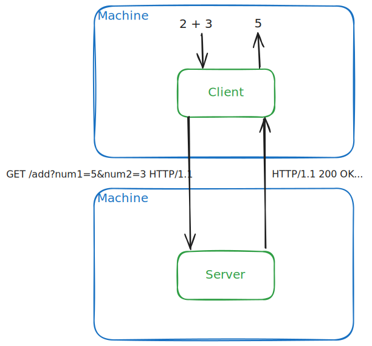
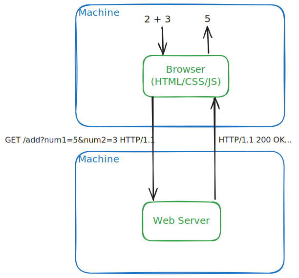
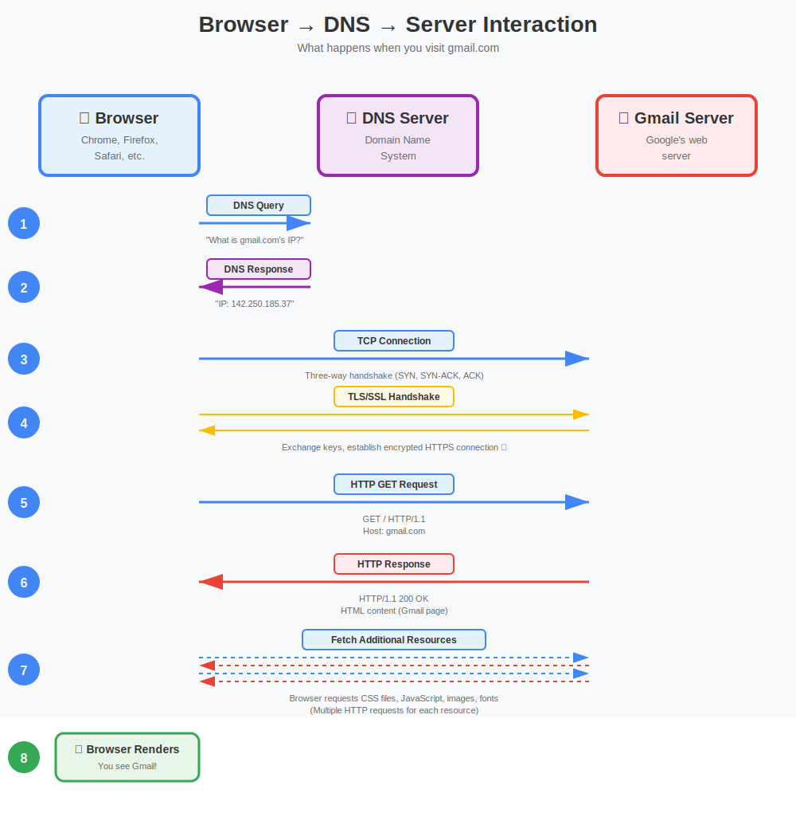

# Introduction

## What's a Web App?

### Local App

- An app that runs locally on a machine

- Demo
  - [calculator.py](../code/local-app/calculator.py)

#### Browser-based Local App

- A special case of a local app that runs in a web browser (Safari, Chrome, Edge, etc.)

- Demo
  - [calculator.html](../code/local-app/browser-based/calculator.html)
  - Activity
    - Students open the html file in their browser

### Distributed App

- An app that runs across multiple machines with a defined application **protocol** for communication

- Demo
  - [server.py](../code/client-server/server.py)
    - Start on cloud VM with external IP: https://console.cloud.google.com/compute/instances
  - Activity
    - Students send requests using `netcat`
      - `echo "Add 2 3" | nc <ip> <port>`

#### HTTP Distributed App

- A distributed app that uses HyperText Transfer Protocol (HTTP) for communication

- Demo
  - [http_server.py](../code/client-server/http/http_server.py)
    - Start on cloud VM with external IP: https://console.cloud.google.com/compute/instances
  - Activity
    - Students send requests using `netcat`
      - `printf "GET / HTTP/1.1\r\nHost: <ip>\r\n\r\n" | nc <ip> <port>`

##### Browser client

- An HTTP distributed app in which clients are web browsers

- Demo
  
  

- Activity
  - Students send requests using their browsers

> This is a web app!
>
> A web app (web application) is a software program that runs in a web browser and is accessed over the internet or a network. Unlike traditional desktop applications that you install on your computer, web apps are hosted on a server and delivered to users through their browser.

## Why Web Apps?

- User doesn't have to install anything
  - Runs in Chrome, Firefox, Safari, etc. 
  - Browsers are ubiquitous (even on mobile devices!)
- User's machine resources are not strained
  - The core logic typically runs on a remote server, not the user's machine.
- Accessible anywhere 
  - As long as the user has internet and a browser, they can access it from any device.
- Always up-to-date
  - Updates happen on the server, so users automatically get the latest version.
- User interface is easier to develop
  - using cross-platform HTML/CSS/JS instead of platform-specific GUI frameworks

## Examples of Web Apps

- Gmail (email)
- Google Docs (word processing)
- Netflix (video streaming)
- Twitter/X (social media)
- Canvas (your LMS)
- Even our calculator we just built with HTML/JavaScript is a simple web app!

## Loading a Web App

